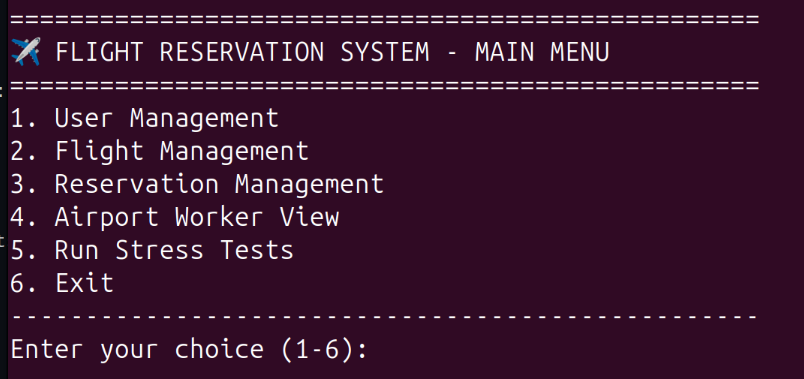

# Flight Reservation System - Application that uses distributed database for managing data.

Used:
- Python 3.10.16
- Docker version 27.5.1
- Cassandra 4.1 

### Commands in terminal:
- starting (detached container):  
  `docker-compose up -d`
- closing: database connections   
  `docker-compose down`
- sctipt for simple preview:
  creating example users, flights, reservations, updating reservation, running 3 stress tests  
  `python3 containers.py`
- run interactive menu  
  `python3 menu.py`  

    
  Airport Worker View means being able to see all information in the system  

### Clean up  after use:
- remove all data from containers:  
  `docker volume prune`
- get rid of inactive containers:  
  `docker container prune`

 ## Database Schema

### Table: `users`

| Column Name | Data Type | Description                |
|-------------|-----------|----------------------------|
| `user_id`   | UUID      | Primary key                |
| `username`  | TEXT      | Name of the user           |
| `email`     | TEXT      | Email address              |
| `created_at`| TIMESTAMP | Account creation time      |

---

### Table: `flights`

| Column Name      | Data Type | Description                    |
|------------------|-----------|--------------------------------|
| `flight_id`      | UUID      | Primary key                    |
| `origin`         | TEXT      | Departure location             |
| `destination`    | TEXT      | Arrival location               |
| `departure_time` | TIMESTAMP | Time of departure              |
| `arrival_time`   | TIMESTAMP | Time of arrival                |
| `available_seats`| INT       | Number of available seats      |

---

### Table: `reservations`

| Column Name       | Data Type | Description                      |
|-------------------|-----------|----------------------------------|
| `reservation_id`  | UUID      | Primary key                      |
| `flight_id`       | UUID      | Foreign key to `flights`         |
| `user_id`         | UUID      | Foreign key to `users`           |
| `seat_number`     | TEXT      | Seat identifier                  |
| `reservation_time`| TIMESTAMP | When reservation was made        |
| `status`          | TEXT      | e.g., 'confirmed', 'canceled'    |

---

### Table: `seat_availability`

| Column Name       | Data Type | Description                                  |
|-------------------|-----------|----------------------------------------------|
| `flight_id`       | UUID      | Part of primary key                          |
| `seat_number`     | TEXT      | Part of primary key                          |
| `is_available`    | BOOLEAN   | Seat availability status                     |
| `reserved_by`     | UUID      | `user_id` of reserver (nullable)             |
| `reservation_time`| TIMESTAMP | Time seat was reserved (if applicable)       |

